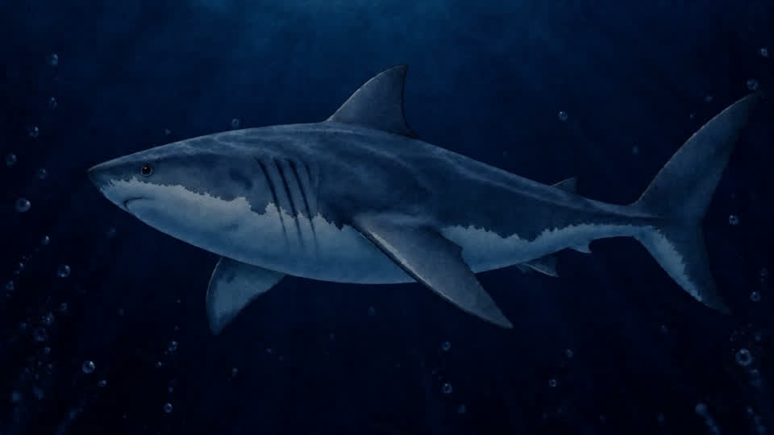
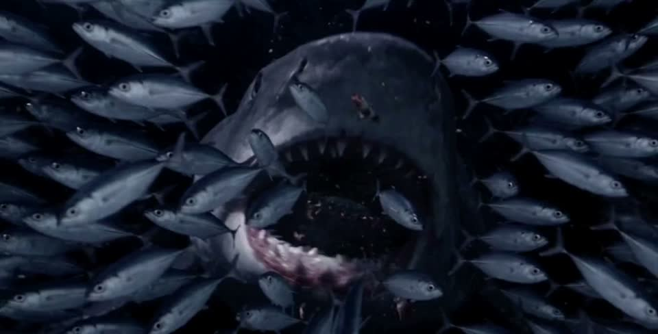

# Worked example: great white turns into the feeding scene

This is a record of the finished connector, based on `docs/production-notes.md` and the current frame timeline in `js/app.js`. It is an example for future seams, not a claim that the historical credit cost or exact submitted prompt was preserved.

## The two shots

The outgoing `assets/video/hammerhead-to-great-white-user-v1.mp4` ends with a side view of the great white. Its final exported frame is `assets/video/hammerhead-to-great-white-user-frames/frame-277.jpg`. The incoming feeding scene begins head-on, with a school of fish, at `assets/video/great-white-to-sixgill-seabed-frames/frame-001.jpg`. The angle, shark pose, and fish density differ too much for a dissolve to hide.

## What failed and why

| Attempt or symptom | Why it failed | Change that addressed it |
| --- | --- | --- |
| Crossfade between the side-on and head-on shots | Both sharks were visible during overlap, making a ghostly double exposure. Shortening the fade did not solve the different poses. | Generate a continuous keyed turn from the outgoing frame to the incoming frame. |
| Feeding shot barely visible | It occupied too little scroll distance, and a heavy black ink veil covered the handoff. | Give feeding about 60vh of scroll, reduce the veil, and cross the following empty water quickly. |
| Original feeding footage looked gritty beside the smooth great-white shot | Motion connected, but texture and lighting changed sharply. | Restyle its first six seconds with Magnific Modify Video while keeping the original motion, then blend back into the darker source water. |

## Recorded bridge production

- Output: `assets/video/great-white-bridge-v1.mp4`.
- Model and settings: Seedance 2.5 through Magnific, 16:9, 720p, 6 seconds, sound off.
- Start image: the exact final outgoing frame, `assets/video/hammerhead-to-great-white-user-frames/frame-277.jpg`.
- End image: the first feeding frame, `assets/video/great-white-to-sixgill-seabed-frames/frame-001.jpg`.
- Prompt intent recorded in the notes: a single smooth stylized underwater shot. The same great white glides forward through dark navy water, slowly turns toward camera, and finishes head-on with its mouth slightly open as silver fish stream in and the water brightens to cobalt. One shark, continuous motion, no cut.
- **Prompt provenance:** that wording is reconstructed from the production-note summary; the exact submitted prompt was not saved. For a new generation, write and review the full exact prompt before spending credits.
- **Credit provenance:** the historical credit estimate and actual charge were not recorded. Obtain a fresh estimate from Magnific's cost simulation for any new attempt; do not reuse a guessed figure.

An exact *proposed* prompt for a future redo, reconstructed from that summary, would be: “One continuous underwater camera shot in the established smooth illustrated style. Begin exactly on the supplied side-view frame: the same great white shark glides forward through dark navy water. It slowly turns toward the camera while the water transitions to cobalt blue and silver fish stream in from both sides. End exactly on the supplied head-on feeding frame, with the same shark centered, mouth slightly open, surrounded by the swirling school. Keep one shark, fluid swimming, consistent anatomy and camera motion, with no cuts.” This is a review draft, not the historical prompt.

The bridge's first exported frame duplicated the previous clip's final frame. Frames 2–73 were exported at 12 fps and 960×540, then appended as frames 278–349 of `assets/video/hammerhead-to-great-white-user-frames/`. The neighbouring endpoint frames were checked. In `renderJourney`, the previous shot's frames 1–277 occupy progress `.55–.81`, the bridge frames 278–349 occupy `.81–.84`, and feeding begins at `.84`. A short handoff occupies `.836–.846` between near-matching frames.

The feeding restyle was a separate Magnific Modify Video pass: MiniMax H3, 2K, 6.6 seconds, applied to the first six seconds of `assets/video/great-white-to-sixgill-user-v1.mp4`. Its goal was smooth stylized cobalt-blue water and neutral gums while preserving movement. The result was retimed into 12 fps frames 1–72; frames 65–72 blend back to the original dark water. The restyled source MP4 is not stored in this repository; the blended frames are. This is a limit of the production record, not a reason to invent an output file or exact prompt.

## What to show for the next review

Before any paid redo, present both actual keyframe previews and paths, one exact bridge prompt, Seedance/model availability checked live, 16:9 / 720p / 6 s / sound-off settings or explained changes, and the current estimated credits returned by Magnific for those inputs. After production, compare the generated endpoints and test the `.81–.84` bridge and `.84` feeding join with slow, fast, and reverse scrolling. Recheck the feeding sound cue at `.845` if timing moves.
